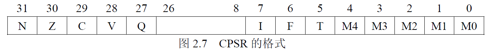
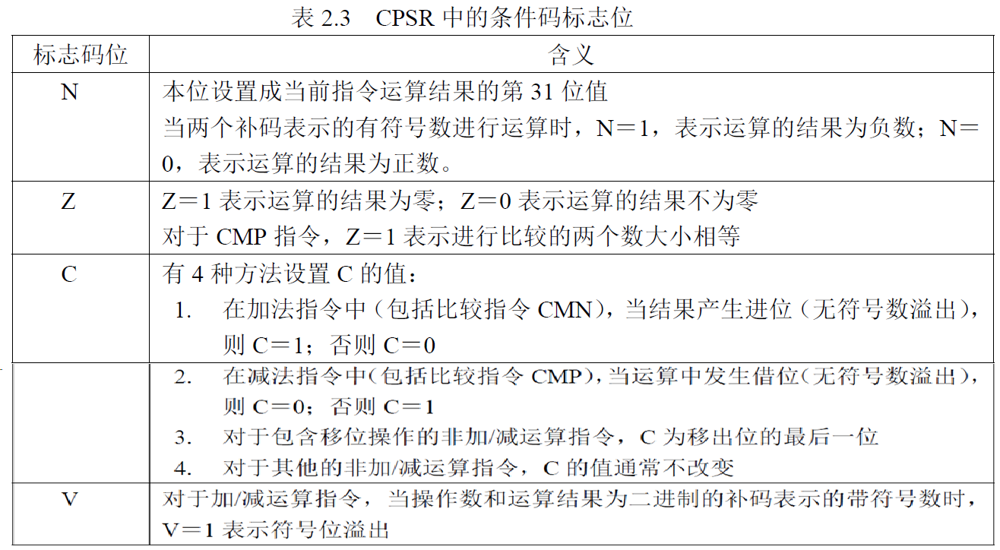

Tiny6410 interrupt
====

###ARM体系CPU的7种工作模式

1. 用户模式（usr）：正常的程序执行状态
2. 快速中断模式（fiq）：用于高速数据传输或通道处理
3. 中断模式（irq）：用于通用的中断处理
4. 管理模式（svc）：操作系统使用的保护模式
5. 系统模式（sys）：运行具有特权的操作系统任务
6. 数据访问终止模式（abt）：当数据或指令预取终止时进入该模式，可用于虚拟存储以及存储保护
7. 未定义指令终止模式（und）：当未定义的指令执行时进入该模式，可用于支持硬件

除了用户模式(usr)以外，其他6种工作模式都属于特权模式。特权模式中除了系统模式以外的其余5种模式称为异常模式。        
大部分程序运行在用户模式，进入特权模式是为了处理中断、异常、或者访问被保护的系统资源。     
    

Arm的工作模式切换有两种方法：

* 被动切换：在arm运行的时候产生一些异常或者中断来自动进行模式切换
* 主动切换：通过软件改变，即软件设置寄存器来经行arm的模式切换，应为arm的工作模式都是可以通过相应寄存器的赋值来切换的。

Tips：当处理器运行在用户模式下，某些被保护的系统资源是不能被访问的。

###ARM体系CPU的2种工作状态
* ARM状态：处理器执行32位的字对齐的ARM指令    
	ARM微处理器共有37个32位寄存器，其中31个为通用寄存器，6个位状态寄存器。但是这些寄存器不能被同时访问，具体哪些寄存器是可以访问的，取决ARM处理器的工作状态及具体的运行模式。但在任何时候，通用寄存器R14~R0、程序计数器PC（即R15）、一个状态寄存器都是可访问的。
* Thumb状态：处理器执行16位的、半字对齐的Thumb指令    
Thumb状态下的寄存器集是ARM状态下寄存器集的一个子集，程序可以直接访问8个通用寄存器（R7～R0）、程序计数器（PC）、堆栈指针（SP）、 连接寄存器（LR）和CPSR。同时，在每一种特权模式下都有一组SP、LR和SPSR。

在程序运行的过程中，可以在两种状态之间进行相应的转换。处理器工作状态的转变并不影响处理器的工作模式和相应寄存器中的内容。

###ARM寄存器

ARM有31个通用的32位寄存器，6个程序状态寄存器，共分为7组（进入某个工作模式，就使用对应某组的寄存器），有些寄存器是所有工作模式共用的，还有一些寄存器专属于每一种工作模式。任何工作模式下，都有通用寄存器R14~R0、程序计数器PC(即R15)、一个状态寄存器是可访问的。

|用户模式(User)|系统模式(System)|管理模式(Supervisor)|数据访问终止模式(Abort)|未定义指令终止模式(Undefined)|外部中断模式(IRQ)|	快速中断模式(FIQ)|
| ------ | ------ |------ |------ |------ |------ |------ |
|R0		|R0			|R0			|R0			|R0			|R0			|R0			|
|R1		|R1			|R1			|R1			|R1			|R1			|R1			|
|R2		|R2			|R2			|R2			|R2			|R2			|R2			|
|R3		|R3			|R3			|R3			|R3			|R3			|R3			|
|R4		|R4			|R4			|R4			|R4			|R4			|R4			|
|R5		|R5			|R5			|R5			|R5			|R5			|R5			|
|R6		|R6			|R6			|R6			|R6			|R6			|R6			|
|R7		|R7			|R7			|R7			|R7			|R7			|R7			|
|R8		|R8			|R8			|R8			|R8			|R8			|R8_fiq		|
|R9		|R9			|R9			|R9			|R9			|R9			|R9_fiq		|
|R10	|R10		|R10		|R10		|R10		|R10		|R10_fiq	|
|R11	|R11		|R11		|R11		|R11		|R11		|R11_fiq	|
|R12	|R12		|R12		|R12		|R12		|R12		|R12_fiq	|
|R13	|R13		|R13_svc	|R13_abt	|R13_und	|R13_irq	|R13_fiq	|
|R14	|R14		|R14_svc	|R14_abt	|R14_und	|R14_irq	|R14_fiq	|
|R15(PC)|R15(PC)	|R15(PC)	|R15(PC)	|R15(PC)	|R15(PC)	|R15(PC)	|
|CPSR	|CPSR		|CPSR		|CPSR		|CPSR		|CPSR		|CPSR		|
|		|			|SPSR_svc	|SPSR_abt	|SPSR_und	|SPSR_irq	|SPSR_fiq	|

####通用寄存器
* **未分组寄存器 R0 ~ R7**    
	在所有运行模式下,未分组寄存器都指向同一个物理寄存器,它们未被系统用作特殊的用途.因此在中断或异常处理进行运行模式转换时,由于不同的处理器运行模式均使用相同的物理寄存器,所以可能造成寄存器中数据的破坏.
* **分组寄存器 R8 ~ R14**    
	同一个寄存器名(例如R13)，在ARM微处理器内部存在多个独立的物理寄存器，每一个物理寄存器分别与不同的处理器模式对应(R13\_fiq, R13\_svc, ... )。这些寄存器被称为“备份寄存器"。       
	对于R8~R12来说,每个寄存器对应2个不同的物理寄存器,当使用FIQ(快速中断模式)时,访问寄存器R8\_fiq~R12\_fiq;当使用除FIQ模式以外的其他模式时,访问寄存器R8_usr~R12\_usr。       
	对于R13,R14来说,每个寄存器对应6个不同的物理寄存器,其中一个是用户模式与系统模式共用,另外5个物理寄存器对应其他5种不同的运行模式,并采用记号来区分不同的物理寄存器: R13\_fiq, R13\_svc, R13\_abt...      
	快速中断模式有7个备份寄存器(R8\_fiq ~ R14\_fiq), 这使得进入快速中断模式执行很大部分程序时，甚至不需要保存R8~R12的寄存器。其他模式，因为要和普通模式共用R8~R12寄存器，所以需要在执行程序前将寄存器入栈，执行完程序后再弹栈。
	* R13 - 堆栈指针寄存器 SP   
		寄存器R13在ARM指令中常用作**堆栈指针SP**,但这只是一种习惯用法，用户也可使用其他的寄存器作为堆栈指针,而在Thumb指令集中,某些指令强制性的要求使用R13作为堆栈指针.    由于处理器的每种运行模式均有自己独立的物理寄存器R13，在用户应用程序的初始化部分，一般都要初始化每种模式下的R13，使其指向该运行模式的栈空间。这样，当程序的运行进入异常模式时，可以将需要保护的寄存器放入R13所指向的堆栈，而当程序从异常模式返回时，则从对应的堆栈中恢复，采用这种方式可以保证异常发生后程序的正常执行。
	* R14 - 程序链接寄存器(Subroutine Link Register)    
		R14称为**程序链接寄存器LR(Link Register)**,当执行子程序调用指令(BL)时,R14可得到R15(程序计数器PC)的备份.在每一种运行模式下，都可用R14保存子程序的返回地址，当用BL或BLX指令调用子程序时，将PC的当前值复制给R14，执行完子程序后，又将R14的值复制回PC，即可完成子程序的调用返回。以上的描述可用指令完成。
* **程序计数器 PC(R15)**    
	寄存器R15用作**程序计数器(PC)**,在ARM状态下,位[1:0]为0,位[31:2]用于保存PC,在Thumb状态下,位[0]为0,位[31:1]用于保存PC.   
	**由于ARM体系结构采用了多级流水线技术，对于ARM指令集而言，PC总是指向当前指令的下两条指令的地址,即PC的值为(当前指令的地址值)加(8个字节);**
* **当前程序状态寄存器 R16**   
	寄存器R16用作**CPSR(CurrentProgram Status Register，当前程序状态寄存器)**，CPSR可在任何运行模式下被访问，它包括条件标志位、中断禁止位、当前处理器模式标志位，以及其他一些相关的控制和状态位。 
	
每一种运行模式下又都有一个专用的物理状态寄存器，称为**SPSR(Saved Program Status Register，备份的程序状态寄存器)**，当异常发生时，SPSR用于保存CPSR的当前值，从异常退出时则可由SPSR来恢复CPSR。由于用户模式和系统模式不属于异常模式，它们没有SPSR，当在这两种模式下访问SPSR，结果是未知的;
	1. 条件码标志（28-31位） N(Negative)、Z(Zero)、C(Carry)及V(Overflow)统称为条件码标志位。其内容可被算术和逻辑运算的结果所改变，由此可以决定某些指令是否被执行。
	
	2. Q标志位（第27位） 在ARM V5及以上版本的E系列处理器中，用Q标志位指示增强的DSP运算指令是否发生了溢出。在其他版本的处理器中，Q标志位无定义。
	3. CPSR的控制位（第7-0位） CPSR的低8位（包括I、F、T和M[4:0]）称为控制位，当发生异常时这些位可以被改变。如果处理器运行特权模式，这些位也可以由程序修改。
		* 中断禁止位I(IRQ)，F(FIQ)： I=1禁止IRQ中断 F=1禁止FIQ中断
		* T(Thumb)标志位：该位反映处理器的运行状态 对于ARM体系结构V4及以上的版本的T系列处理器，当该位为1时，程序运行与Thumb状态，否则运行于ARM状态。 对于ARM体系结构V5及以上的版本的非T系列处理器，当该位为1时，执行下一条指令以引起未定义的指令异常；当该位为0时，表示运行于ARM状态。
		* 运行模式位M[4:0]：M0、M1、M2、M3、M4是模式位。这些位决定了处理器的运行模式。    
 
			|M[4:0]|处理器模式|
			| ---- | ------ |
			| 0b10000 | 用户模式 |
			| 0b10001 | 快速中断(FIQ) |
			| 0b10010 | 外部中断(IRA) |
			| 0b10011 | 管理模式 |
			| 0b10111 | 中止模式 |
			| 0b11011 | 未定义模式 |
			| 0b11111 | 系统模式 |
		* 其他的位为保留位，用作以后的扩展。

----

###异常工作流程
产生一个异常后，CPU自动执行：

1. 在异常工作模式的连接寄存器R14中，保存前一个工作模式的下一条要执行的指令的地址（方便返回）。对于ARM状态下工作的CPU， 这个地址是当前PC值加4或加8；
2. 将CPSR的值复制到异常模式的SPSR（SPSR就是用来保存前一个工作模式的CPSR的）。
3. 将CPSR的工作模式设为这个异常对应的工作模式。
4. 令PC值等于这个异常模式在异常向量表中的地址，即跳转去执行异常向量表的相应指令。

执行完异常向量服务后，应该在程序的最后，软件实现下面工作，返回之前的工作模式。

1. 将连接寄存器R14的值减去合适的值（4或8）后，复制给PC。之前存的是R14=PC+4的话，现在就是R14-4=PC;
2. 将SPSR的值复制回CPSR。

| 异常模式 | 进入异常模式时R14保存的值(ARM状态) | 退出异常时PC的计算方法 |
| ----- | ----- | ----- |
| 管理模式(通过SWI指令进入该模式) | PC(SWI指令地址) + 4 | MOVS PC, R14 |
|未定义指令终止模式 | PC(未定义指令地址) + 4 | MOVS PC, R14 |
|快速中断模式| PC(进入快速中断模式前，被打断，未执行的指令地址) + 4| SUBS PC, R14, #4 |
|中断模式| PC(进入中断模式前，被打断，未执行的指令地址) + 4| SUBS PC, R14, #4|
|数据访问终止模式|PC(导致数据访问终止的指令地址)+4|SUBS PC, R14, #4|
|数据访问终止模式|PC(导致数据访问终止的指令地址)+8|SUBS PC, R14, #8|

* 管理模式，未定义指令终止模式，进入异常模式时，PC为SWI指令或未定义指令地址，将下一步要执行的执行地址(PC+4)存入R14, 退出异常模式时，将R14传给PC即可。
* 中断，数据访问终止模式，PC为被中断、被终止的指令地址，将其PC+4的值传给R14，退出异常模式时，要将R14的值减去4再传给PC，则重新执行之前被打断的指令。

----

 