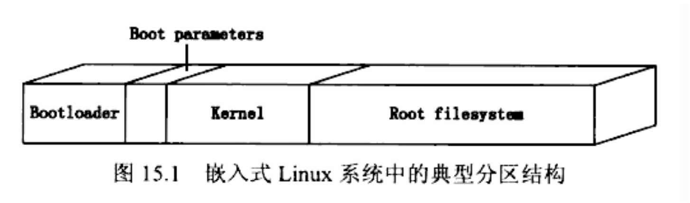

MTD
=======

Friendly ARM提供的内核 linux-2.6.38:

linux-2.6.38/arch/arm/mach-s3c64xx/mach-mini6410.c

    /* Nand flash */
    struct mtd_partition mini6410_nand_part[] = {
        {
            .name       = "Bootloader",
            .offset     = 0,
            .size       = (4 * 128 *SZ_1K),
            .mask_flags = MTD_CAP_NANDFLASH,
        },
        {
            .name       = "Kernel",
            .offset     = (4 * 128 *SZ_1K),
            .size       = (5*SZ_1M) ,
            .mask_flags = MTD_CAP_NANDFLASH,
        },
        {
            .name       = "File System",
            .offset     = MTDPART_OFS_APPEND,
            .size       = MTDPART_SIZ_FULL,
        }
    };
   
Nand Flash布局（1024M空间):
 
1. Bootloader, 0x0 ~ 0x80000, 512K;
2. Kernel, 0x80000 ~ 0x580000, 5M;
3. File System, 0x580000 ~ 0x40000000, (1018.5M)

ARM板子的MTD输出:

	[root@FriendlyARM /]# uname -a
	Linux FriendlyARM 2.6.38-FriendlyARM #15 PREEMPT Tue Oct 14 16:02:12 CST 2014 armv6l unknown
	[root@FriendlyARM /]# cat /proc/mtd
	dev:    size   erasesize  name
	mtd0: 00080000 00020000 "Bootloader"
	mtd1: 00500000 00020000 "Kernel"
	mtd2: 3fa80000 00020000 "File System"

使用FriendlyARM提供的bootloader(SuperBoot-6410.bin),下载Bootloader会下载到Nand Flash开头的512K空间，下载内核是会下载到0x80000开头的5M空间，下载文件系统会下载到0x580000开头的空间。

----

如果使用U-Boot引导Linux, 需要设置mtdparts变量：

`set bootargs “noinitrd console=ttySAC0 root=/dev/
mtdblock3 rootfstype=jffs2 mtdparts=nand_flash:128k(u-boot)ro,64k(u-
boot envs),3m(kernel),30m(root.jffs2),30m(root.yaffs) ” `

且可以在之后的nand read/write/erase命令中直接使用分区的名字而无需指定绝对地址。 
