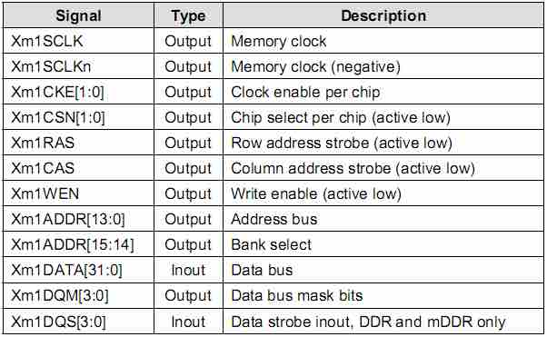

ARM-Tiny6410-DRAM
====

<http://www.samsung.com/us/business/oem-solutions/pdfs/PSG_2H_2012.pdf>    
DRAM:       
SAMSUNG K4X2G323PD-8GD8   
Mobile DDR     
64Mx32    
200Mhz     
Halogen Free FBGA90    
90-FBGA, 800MHz      
1.8V

	K4X2G323PD-8GD8 
	K:		SAMSUNG Memort
	4:	 	DRAM
	X:		Mobile DDR SDRAM
	2G:	2G, 8K/64ms
	32:	x32 (bit organization)		3:		4 of Internal Banks
	P:		LVTTL, 1.8V, 1.8V
	D:		5th Generation
	
	S/D: 90balls FBGA
	
**DDR SDRAM**:    
Double Rate Synchronous Dynamic Random Access Memory    
双倍速率传输，在时钟的上升沿和下降沿均可传输数据。

----

硬件连接：


	nCS: 		Xm1CSn0
	nRAS:		Xm1RASn
	nCAS:		Xm1CASn
	nWE:		Xm1WEn
	
----

###DRAM控制器（DRAM CONTROLLER）
参考：<http://www.linuxidc.com/Linux/2011-09/42025.htm>   

6410使用DRAM控制器对DDR进行操作。   
在程序开始时要根据DDR的参数设置DRAM控制器。

S3C6410的DRAM控制器是采用的PL340内存控制芯片(ARM PrimeCell CP003 AXI Dynamic Memory Controller)。   

AMBA APB3.0接口协议规定，可以通过编程将AXI从总线接口和APB主总线接口进行桥接，实现二者总线上的数据的传输。

DRAM控制器可以通过配置**兼容SDRAM类型芯片**。通过向DRAM控制器中PL340写入内存芯片配置参数，内存时序，来控制内存工作。 

DRAM控制器可以直接从SDRAM或DRAM接收一个控制命令：

* 通过将操作命令写入direct_cmd寄存器，操作SDRAM进行对应操作。

* 通过向memc_cmd寄存器写入状态模式命令，使DRAM控制器进入对应的工作模式。

例如：向direct_cmd寄存器写入：'Prechargeall’，‘Autorefresh’，‘NOP’，and ‘MRS’ 等命令，可以让SDRAM芯片分别执行不同操作，向memc_cmd寄存器写入一些状态命令可以让SDRAM芯片进入’Config’, ‘Ready’, and ‘Low_power’等工作模式。 

DRAM控制器支持两种节能模式。当SDRAM处于不活动状态并且持续一定的时钟周期时，DRAM控制器会自动将SDRAM进入预充电节能模式或正常节能模式下以降低系统功耗。当驱动操作DRAM控制器进入对应的STOP（停止），Deep Stop（深度睡眠），Sleep Mode（睡眠）等模式时，SDRAM芯片进入自刷新的节能模式。

* 支持SDR SDRAM，Mobile SDR SDRAM，DDR SDRAM和Mobile DDR SDRAM类型芯片

* 支持两个内存芯片

* 支持64位的AMBA AXI总线类型

* 支持16位、64位内存总线
		
	* 存储器接口1：支持16位DDR SDRAM和Mobile DDR SDRAM类型芯片；
	*	支持32位DDR SDRAM，Mobile DDR SDRAM，Mobile SDR SDRAM和SDR SDRAM类型芯片；
	*	不支持16位Mobile SDR SDRAM和SDR SDRAM类型芯片

* 地址空间：存储器接口1支持最多2Gb地址空间
* 支持正常节能模式和预充电的节能模式
* 数据传输低延迟特性
* 外部存储器总线优化
* 通过设置SFR寄存器支持选择外部存储器选型
* 通过SFR寄存器配置存储器的时序
* 支持扩展MRS指令集
* 工作电压：存储器接口1:   1.8V，2.5V

----


####SDRAM类型内存接口


DRAM控制器支持最多两个相同类型的内存芯片，每个芯片最大容量256M。所有芯片共享相同引脚（时钟使能引脚和片选引脚除外），如表所示给出了DRAM控制器的外部存储器引脚配置信息。


####  SDRAM INITIALIZATION SEQUENCE - DDR/MOBILE DDR SDRAM
在系统上电后，必须通过软件配置SDRAM接入DRAM控制器并且初始化DRAM控制器，下面给出DDR、MOBILE DDR SDRAM的初始化流程。

a) 向mem_cmd寄存器写入2b10，使其进入NOP工作状态

b) 向mem_cmd寄存器写入2b00，使其进入Prechargeall（整片预充电）工作状态

c) 向mem_cmd寄存器写入2b11，使其进入Autorefresh（自刷新）工作状态

d) 再次向mem_cmd寄存器写入2b11，使其进入Autorefresh（自刷新）工作状态

e) 向mem_cmd寄存器写入2b10，使其进入MRS工作状态，并且地址空间内的EMRS必须置位

f) 再次向mem_cmd寄存器写入2b10，使其进入MRS工作状态，并且地址空间内的MRS必须置位

----

* DRAM控制器状态寄存器（P1MEMSTAT）
* DRAM控制器命令寄存器（P1MEMCCMD）
* DRAM直接命令寄存器（P1DIRECTCMD）

----