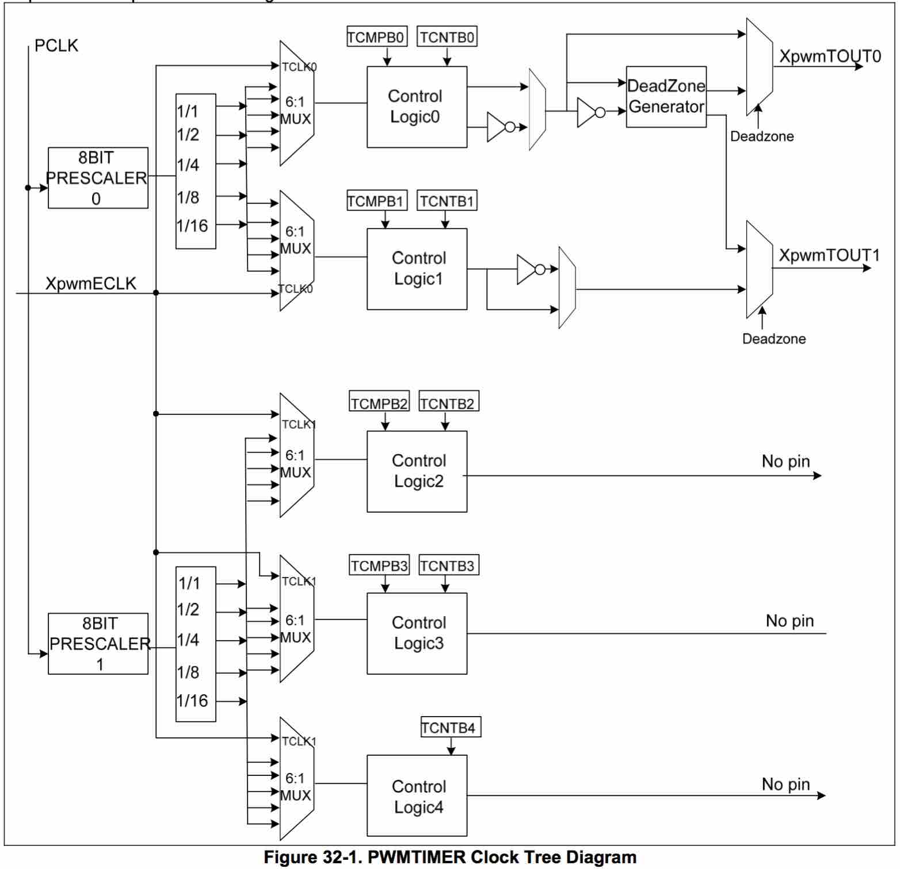

S3C6410 - Timer
====

S3C6410X RISC微处理器有5个32位的定时器。    
这些定时器在ARM子系统中主要是用来产生内部中断(internal interrupts):

* 定时器0和定时器1包含了PWM(Pulse Width Modulation) 功能，可以用来驱动一个外部I/O信号(XpwmTOUT0/XpwmTOUT1)。定时器0和定时器1具有可选的死区发生器的功能，可以用来支持更多的设备。
* 定时器2，3，4是内部定时器，没有输出引脚。

PWM支持如下特性:

* 五个32位的定时器；
* 多级分频，第一级为8位的时钟预分频器(8 bit Prescaler)，在第二级为5固定分频器和多路选择器。
* 对每个PWM都有独立的可编程时钟选择逻辑(Programmable Clock Select Logic)；
* 两个独立可编程占空比控制和极性的PWM通道(Programmable Duty Control and Polarity)；
* 支持自动加载模式(Auto-Reload Mode)和单脉冲模式(One-Shot Pulse Mode)；
* 支持外部输入来启动PWM；
* 两个PWM输出上都有死区发生器(Dead Zone Generator)；
* 支持DMA传输；
* 可选脉冲(Pluse)或电平中断(Level Interrupt Generation)；
* PWM支持两种操作模式：
	* 自动装载模式(Auto-Reload Mode)    
		基于可编程占空比和极性, 产生连续的PWM脉冲。
	* 单脉冲模式(One-Shot Pulse Mode)    
		基于可编程占空比和极性, 仅产生单个脉冲。
		
提供了16个特殊功能寄存器来控制PWM的功能。PWM是可编程输出的。我们可以通过APB来访问PWM内部的16个特殊功能寄存器。		

----

###Timer Clock Tree Diagram
定时器的时钟源为PCLK，经过两个8位预分频器降低频率：    

* 定时器0,1共用第一个预分频器
* 定时器2,3,4共用第二个预分频器

预分频器的输出将进入第二级分频器（5个固定的分频系数）。每个定时器都包含这样一个私有的时钟分频器，提供了时钟分频(通过2，4，8或者16进行预分频)。

最后再经过6选1数据选择器，选择一个时钟信号，作为定时器的时钟信号。

1. XpwmECLK    
	定时器可以从外部引脚选择时钟源。
2. PCLK -> 8Bit Prescaler -> 1/1
3. PCLK -> 8Bit Prescaler -> 1/2
4. PCLK -> 8Bit Prescaler -> 1/4
5. PCLK -> 8Bit Prescaler -> 1/8
6. PCLK -> 8Bit Prescaler -> 1/16

* 定时器0,1可以选择外部时钟TCLK0.   
* 定时器2,3,4可以选择TCLK1.   

###内部控制逻辑

1. 程序初始，设定TCMPBn, TCNTBn这两个寄存器，它们表示定时器n的比较值, 初始计数值。
2. 随之设置TCON寄存器启动定时器n，这时，TCMPBn、TCNTBn的值将被装入其内部存储器TCMPn、TCNTn中。在定时器n的工作频率下，TCNTn开始减1计数，其值可以通过读取TCNTOn寄存器得知。
3. 当TCNTn的值等于TCMPn的值时，定时器n的输出管脚TOUTn反转；TCNTn继续减1计数。
4. 当TCNTn的值到达0时，其输出管脚TOUTn再次反转，并触发定时器n的中断（如果中断使能的话）。
5. 当TCNTn的值到达0时，如果在TCON寄存器中将定时器n设为“自动加载”，则TCMPBn和TCNTBn寄存器的值被自动装入TCMPn和TCNTn寄存器中，下一个计数流程开始。

定时器n的输出管脚TOUTn初始状态为高电平，以后在TCNTn的值等于TCMPn的值、TCNTn的值等于0时反转。也可以通过TCON寄存器设置其初始电平，这样TOUTn的输出就完全相反了。    
通过设置TCMPBn、TCNTBn的值可以设置管脚TOUTn输出信号的占空比，这就是所谓的可调制脉冲(PWM)，所以这些定时器又被称为PWM定时器。

每一个定时器都有自己的被时钟驱动的32位减计数器。减计数器最初是通过定时器计数缓冲寄存器(TCNTBn)装载的。当减计数器到达0，定时器就会向CPU请求中断，标示定时器操作完毕。

当减计数器到达0，TCNTBn里面的数值可以自动的装载到减计数器中，开启下一个周期(自动装载模式下)。然而，如果定时器停止了，例如：在定时器运行的状态通过清除TCONn寄存器中定时器使能位，那么，TCNTBn中的数值就不会被装载到减计数器中了。

脉宽调制(PWM)的功能要用到TCMPBn寄存器里面的数值。当减计数器中的数值和定时器控制逻辑中的比较寄存器的数值匹配的时候，定时器控制逻辑将会改变输出极性(切换输出引脚的高低电平)。    
因此，比较寄存器决定了PWM输出的开启时间(或者是关闭时间)。   
TCNTBn和TCMPBn寄存器都是双缓冲的，这样就允许我们在一个周期之间改变定时器的参数。新的值将会在这个周期结束之后生效。

----

###寄存器用法

**TCFG0寄存器**：位[7：0]、位[15:8]分别被用于控制预分频器0、1，它们的值为0~255.经过预分频器出来的时钟频率为：PCLK/{prescaler value+1}。

TCFG1寄存器：经过预分频器得到的时钟将被2分频、4分频、8分频和16分频，除这4种频率外，额外地，定时器0、1还可以工作在外接的TCLK0时钟下，定时器2、3、4还可以工作在外接的TCLK1时钟下。通过TCFG1寄存器来设置这5个定时器，分别工作于这5个频率中哪一个之下。

TCNTBn/TCMPBn寄存器：n为0~4，这两个寄存器都只用到位[15:0]，TCNTBn中保存定时器的初始计数值，TCMPBn中保存比较值。它们的值在启动定时器时，被传到定时器内部寄存器TCNTn、TCMPn中。没有TCMPB4，因为定时器4没有输出引脚。

TCNTOn寄存器：n位0~4，定时器n被启动后，内部寄存器TCNTn在其工作时钟下不断减1计数，可以通过读取TCNTOn寄存器得知其值。

TCON寄存器：有四个作用，a、第一次启动定时器时“手动”将TCNTBn/TCMPBn寄存器的值装入内部寄存器TCNTn、TCMPn中；b、启动、停止定时器；3、决定在定时器计数达到0时是否自动将TCNTBn/TCMPBn寄存器的值装入内部寄存器TCNTn、TCMPn中；4、决定定时器的管脚TOUTn的输出电平是否反转。

在第一次使用定时器时，需要设置“手动更新”位为1以使TCNTBn/TCMPBn寄存器的值装入内部寄存器TCNTn、TCMPn中。下一次如果还要设置这一位，需要先将它清0。